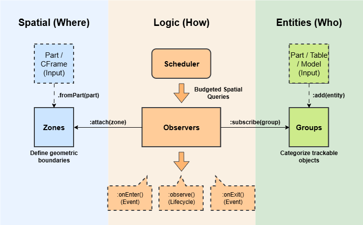

# Usage

QuickZone is designed around a three-tier architecture: Zones (where), Groups (who), and Observers (how).



```lua
local QuickZone = require(game:GetService('ReplicatedStorage').QuickZone)
local Zone, Group, Observer = QuickZone.Zone, QuickZone.Group, QuickZone.Observer
```

## The Three Approaches

QuickZone is unopinionated. Depending on your project's architecture, you can interact with the spatial data in three distinct ways:

### 1. The Lifecycle Approach (Recommended)
This uses the .observe() pattern. It is the most robust way to manage persistent states (like UI, music, or attributes). You define an entry behavior and return a cleanup function for exit.

```lua
observer:observePlayer(function(player, zone)
    -- Logic here runs when entering
    return function()
        -- Logic here runs when exiting
    end
end)
```

### 2. The Event-Driven Approach (Classic)
Standard onEnter and onExit signals. This is best for one-off actions like playing a sound, triggering an achievement, or logging analytics.

```lua
observer:onPlayerEnter(function(player, zone)
    print(player.Name .. " entered " .. zone:getId())
end)
```

### 3. The ECS Approach (Data-Oriented and Procedural)
Ideal for ECS frameworks like Jecs or Matter. Instead of waiting for events, your systems poll the state every frame using zero-allocation iterators. You should disable the internal scheduler to step the engine manually for perfect determinism.

```lua
QuickZone:setAutoUpdate(false) -- Disable auto-loop

local function spatialSystem(dt)
    QuickZone:update(dt) -- Steps it deterministically once per frame.
end

local function observerSystem(dt)
	for player, zone in observer:iterZonesOfPlayers() do 
		-- Process spatial data frame-by-frame with zero GC pressure
	end
end
```

## 1. Zones
Zones represent physical areas in the world. They are mathematical boundaries that can be static (fixed in space) or dynamic (following a part). They can be created from existing parts or defined manually with a CFrame and Size.

### Bulk Creation
The easiest way to create zones is using the bulk constructors. The `fromParts`, `fromDescendants`, `fromChildren`, and `fromTag` return a Zones collection object, which acts as a logical unit allowing you to manage multiple zones at once.

```lua
-- Create zones from a CollectionService tag
local lavaZones = Zone.fromTag('Lava', {
	metadata = { damage = 10 },
	observers = { damageObserver },
})

-- Create zones from an array of parts
local safeZones = Zone.fromParts(workspace.SafeZones:GetChildren())

-- Create zones from all BaseParts inside a Model or Folder (Deep search)
local hazardZones = Zone.fromDescendants(workspace.TrapModel)

-- Create zones from only the direct children of a Folder (Shallow search)
local flatZones = Zone.fromChildren(workspace.FlatFolder)

-- You can attach an observer to the entire collection at once
safeZones:attach(invincibilityObserver)
```

### Manual Creation
Useful for procedural generation or areas without physical parts.

```lua
local zone = Zone.new({
	cframe = CFrame.new(0, 10, 0),
	size = Vector3.new(10, 10, 10),
	shape = 'Block',
	isDynamic = true,
	metadata = { Name = 'Lobby' }
})
```

### Single & Dynamic Creation
For maximum perfomance, use `isDynamic = true` for zones attached to moving platforms, vehicles, or projectiles.
```lua
local trainZone = Zone.fromPart(workspace.TrainCarriage, { 
	isDynamic = true,
	metadata = { route = 'North' },
	observers = { trainObserver }
})
```
:::info Performance Optimization: Static vs. Dynamic
QuickZone batches tree rebuilds once per frame. By adding a zone to the smaller Dynamic LBVH, you prevent rebuild of the large Static LBVH and make the rebuild of the Dynamic LBVH super quick.
:::

### Updating Zones
If you create a zone manually or want to sync a dynamic zone to a new reference, use `:syncToPart()`.

```lua
-- Manually move a dynamic zone
dynamicZone:setPosition(Vector3.new(0, 50, 0))

-- Sync a dynamic zone to its associated part's current CFrame, Size, and Shape
dynamicZone:syncToPart()
```

## 2. Groups
Groups are collections of entities (Parts, Models, Players, etc.).

### Specialized Groups
QuickZone provides built-in abstractions that automatically handle player lifecyles.

```lua
-- Tracks all players in the server
local allPlayers = Group.players()

-- Tracks only the local player (client-side only)
local myPlayer = Group.localPlayer()
```

### Custom Groups
For NPCs, projectiles, or vehicles, create a standard Group.

```lua
local projectiles = Group.new({
	entities = workspace.Projectiles:GetChildren()
})
```

### Managing Entities
You can add BaseParts, Models, Attachments, Bones, or tables with a Position.

```lua
-- Add a Model (tracks the PrimaryPart or Pivot)
enemies:add(npcModel)

-- Add a specific Attachment (tracks the exact point)
-- This is great for offsets if you do not want to track the middle of a part (e.g. sword tip)
enemies:add(sword.TipAttachment)

-- Add a table
local spell = { Position = Vector3.new(10, 5, 0) }
enemies:add(spell)

-- Clear the enemies group when done
enemies:clear()
```

## 3. Observers

Observers act as the logic layer. They subscribe to Groups and attach to Zones to bridge spatial data with game behavior.

### Setup
An Observer listens to its subscribed Groups and checks if they overlap with its attached Zones.

```lua
local observer = Observer.new({
	updateRate = 60,   -- Check up to 60 times a second
	precision = 1.0,   -- Only query if the entity moves more than 1 stud
	priority = 5       -- Used to resolve overlapping zones
})

observer:subscribe(allPlayers)
healingZones:attach(observer)
```

### Lifecycle Management
For logic that should persist while an entity is inside a zone (e.g., UI, music, status effects), use the observe methods. These accept a callback that returns a cleanup function, which runs automatically when the entity exits.

```lua
-- Generic observation
observer:observe(function(entity, zone)
	print('Entered', entity)
	local highlight = Instance.new('Highlight', entity)
	
	return function()
		print('Exited', entity)
		highlight:Destroy()
	end
end)

-- The callback fires when the first entity of a group enters, and the 
-- returned cleanup function fires when the last entity of the group leaves.
observer:observeGroup(function(group, zone)
	print('Group ' .. group:getId() .. ' has arrived!')
	local boss = workspace.Boss:Clone()
	boss.Parent = workspace
	
	return function()
		print('The group has been wiped out or left.')
		boss:Destroy()
	end
end)

-- Player specific
observer:observePlayer(function(player, zone)
	local forceField = Instance.new('ForceField', player.Character)
	
	return function()
		forceField:Destroy()
	end
end)

-- LocalPlayer specific
observer:observeLocalPlayer(function(zone)
	local sound = workspace.Sounds.SafeZoneAmbience
	sound:Play()

	return function()
		sound:Stop()
	end
end)
```

### Events
For logic that happens exactly once on entry or exit (e.g., playing a sound effect, dealing damage, analytics), use the event listeners.

```lua
-- Individual entity events
observer:onEnter(function(entity, zone)
	print(entity.Name .. ' entered ' .. zone:getId())
end)
observer:onExit(function(entity, zone)
	print(entity.Name .. ' exited ' .. zone:getId())
end)

-- Transition event (Fires when swapping between overlapping zones within the same observer)
observer:onTransition(function(entity, newZone, oldZone)
    print(entity.Name .. ' seamlessly moved to a new zone without leaving the area!')
end)

-- Group-level events
observer:onGroupEnter(function(group, zone)
	print('The first member of group ' .. group:getId() .. ' entered!')
end)
observer:onGroupExit(function(group, zone)
	print('The last member of group ' .. group:getId() .. ' left!')
end)

-- Convenient player events
observer:onPlayerEnter(function(player, zone) ... end)
observer:onPlayerExit(function(player, zone) ... end)
observer:onPlayerTransition(function(player, newZone, oldZone) ... end)
observer:onLocalPlayerEnter(function(zone) ... end)
observer:onLocalPlayerExit(function(zone) ... end)
observer:onLocalPlayerTransition(function(newZone, oldZone) ... end)
```

### Handling Overlapping Zones (Transitions vs. Priorities)
When zones physically overlap in the world, QuickZone offers two distinct architectural patterns to handle them, depending on your goal.
Observers use a priority system to handle overlapping zones. An entity 'belongs' to only one zone state per observer at a time when using priorities.

#### Pattern 1: The Data-Driven Pattern (Single Observer + Transitions)
**Best for**: Systems that share the exact same logic, but use different values (e.g., all Environmental Hazards, all Healing Zones, all XP Zones).

If a player walks from a Lava zone into an overlapping SuperLava zone attached to the same observer, they never actually "left" the observer's overall coverage area. Therefore, onExit and onEnter will not fire. Instead, the engine fires an onTransition event.

This allows you to update metadata instantly!

```lua
hazardObserver:observePlayer(function(player, initialZone)
    local currentDamage = initialZone:getMetadata().Damage or 10
    local active = true

    local disconnectTransition = hazardObserver:onPlayerTransition(function(transitioningPlayer, newZone, oldZone)
        if transitioningPlayer ~= player then return end
        
        currentDamage = newZone:getMetadata().Damage or 10
        print(player.Name .. " transitioned. New damage: " .. currentDamage)
    end)

    task.spawn(function()
        while active do
            player.Character.Humanoid:TakeDamage(currentDamage)
            task.wait(1)
        end
    end)

    return function()
        active = false
        disconnectTransition() -- Clean up the listener
    end
end)
```

#### Pattern 2: The State-Machine Pattern (Multiple Observers + Priorities)
**Best for**: Systems with mutually exclusive logic that need to strictly override each other (e.g., Camera Filters, Music Tracks, UI States).

If you have overlapping zones that do fundamentally different things, you should attach them to different observers and assign them a Priority. QuickZone's engine will automatically force the entity out of the lower-priority observer and into the higher-priority one.

```lua
local lowPriority = Observer.new({ priority = 0 })
local highPriority = Observer.new({ priority = 10 })

-- If a player is inside Zone A (Low) and Zone B (High) simultaneously:
-- 1. highPriority:onEnter() fires for Zone B.
-- 2. lowPriority:onExit() fires for Zone A.
```

### Observer State
Observers can be toggled to pause logic without destroying the configuration.

```lua
observer:setEnabled(false) -- Fires 'onExit' for everyone inside
task.wait(5)
observer:setEnabled(true)  -- Fires 'onEnter' if they are still there
```

---

## Utility

### Frame Budget
To maintain a high framerate in complex scenes, you can constrain the total CPU time QuickZone is allowed to consume per frame.

```lua
-- Allow 0.5 milliseconds per frame (default is 1ms)
QuickZone:setFrameBudget(0.5)
```

### Immediate Spatial Queries
Perform instant checks without using the Observer/Group pattern.

```lua
-- Get all zones at a specific vector
local zones = QuickZone:getZonesAtPoint(Vector3.new(10, 5, 0))

-- Get the group an entity belongs to
local group = QuickZone:getGroupOfEntity(workspace.Part)
```

---

## Considerations
- **Point-Based Tracking:** QuickZone tracks the precise coordinate of an entity (Center, Attachment, or Pivot). It does not calculate the full volume intersection of the entity itself.

- **Movement Threshold (Precision)**: QuickZone only re-calculates spatial state when an entity moves beyond a certain distance. Setting a higher precision value (e.g., 2.0 studs) significantly reduces overhead for slow-moving objects.

- **Budgeted Latency**: To prevent frame drops, QuickZone 'smears' workload across multiple frames. In high-load scenarios (e.g., thousands of active entities), there may be a slight delay between an entity physically entering a zone and the event firing.