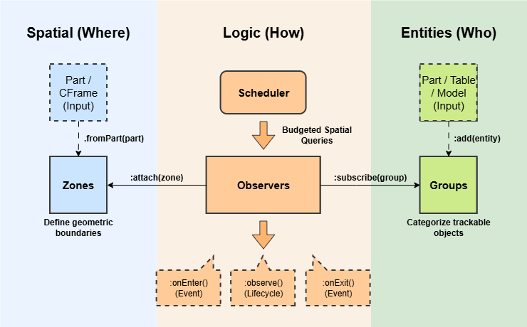

# Why use QuickZone?
Traditional zone libraries like ZonePlus and SimpleZone act as wrappers for Roblox's physics engine (e.g., `GetBoundsInBox`, `GetPartsInPart` or `.Touched`), resulting in expensive collision geometry calculations and synchronization overhead.

QuickZone bypasses the physics engine in favor of geometric math and data-oriented design. It implements a Linear BVH (LBVH) that resolves spatial queries using math compiled to machine code to prevent interpreter overhead.

### 1. The Entity-Centric Model

Traditional libraries are Zone-Centric. They iterate through every Zone instance and query the physics engine for overlapping parts (i.e. entities in QuickZone-terms).

- **The Scaling Problem**: Performance worsens as you add more zones (*O(Z)*), even if the number of entities remains static.

QuickZone, on the other hand, is Entity-Centric. It keeps a list of entities and queries them against an LBVH (*O(N log Z)*). 

- **The Benefit**: This means that you can have hundreds, even thousands, of zones with very low runtime cost. The cost effectively becomes a factor of the number of entities that are being processed.

### 2. Data-Oriented Design (DOD)
QuickZone focuses on how data is laid out in memory based on DOD principles.

- **Contiguous Arrays**: Unlike standard OOP where data is scattered across the heap in different objects, QuickZone stores entity data in pre-allocated, contiguous arrays to improve CPU cache locality.

- **Stable Memory**: By using flat arrays and object pooling, QuickZone generates almost no garbage during runtime. This prevents lag spikes caused by the GC.

### 3. Architecture
QuickZone moves away from monolithic, instance-bound logic in favor of a Group-Observer-Zone topology. This architecture separates what is being tracked from where the tracking occurs and how the system should respond.



#### Groups
A Group is a collection of entities that share performance characteristics and logical categorization. Performance can be configured per Group.

```lua
-- Real-time frequency (60Hz), zero tolerance.
local cameraGroup = QuickZone.Group({
    updateRate = 60,
    precision = 0,
})

-- Low frequency (2Hz), low precision.
local NPCGroup = QuickZone.Group({
    updateRate = 2,
    precision = 4,
})
```

This prevents wasting CPU cycles checking a slow-moving NPC, for example.

#### Observers
Observers act as the logic bridge. They subscribe to Groups and attach to Zones, creating a many-to-many relationship that keeps game logic decoupled and clean.

```lua
-- Create an Observer and subscribe to a group
local safeObserver = QuickZone.Observer()
safeObserver:subscribe(QuickZone.LocalPlayerGroup())

-- Logic is defined once, not per zone
safeObserver:onEntered(function(player, zone)
    print('Entered Safe Zone:', zone:getId())
end)

-- Create Zones from parts and attach them to the observer
for _, part in workspace.SafeZones:GetChildren() do
    if part:IsA('BasePart') then
        local zone = QuickZone.ZoneFromPart(part)
        zone:attach(safeObserver)
    end
end
```

### 4. The Budgeted Scheduler
A common issue with spatial libraries is stutter due to it processing too many things in one frame. QuickZone fixes this via its smart Scheduler.

#### Frame Budgeting
You can set a hard time limit (e.g., 1ms). The Scheduler monitors os.clock() in real-time. If the budget is met, the system pauses immediately and resumes in the next frame. This guarantees that QuickZone will never be the cause of a frame drop.

#### Workload Smearing
The scheduler smears updates across frames. This means that, if you have a Group of 600 entities updating at 10Hz, QuickZone will process exactly 100 entities per frame at 60 fps. This ensures that we have flat, predictable performance profile with no peaks or valleys.

#### No starvation
The Scheduler uses a Round-Robin strategy for Group processing. Instead of processing groups in order, QuickZone cycles through them fairly. This prevents the issue where a heavy group keeps consuming the entire frame budget and 'starving' the subsequent groups.

### 5. Dual-LBVH and Batched Rebuilding
To maintain high performance, QuickZone maintains two LBVHs:

- **The Static LBVH**: Contains all non-moving, non-resizing zones.

- **The Dynamic LBVH**: Contains zones attached to moving parts (e.g., vehicles, platforms).

#### Optimization via Batching
Rebuilding an LBVH is computationally expensive. QuickZone optimizes this by batching updates per frame: if multiple zones are added, removed, or moved in a single frame, QuickZone will only perform a single rebuild at the start of the Scheduler step.

By separating static and dynamic zones, QuickZone minimizes the workload of the LBVH rebuilder. Rebuilding a small tree of 5 moving platforms is significantly faster than rebuilding a tree containing 500 static buildings.

:::info Frame budget
Rebuilding the LBVHs is part of the frame budget. Thus, rebuilding will result in less time for processing the groups of entities.
:::

### 6. Flexibility
Because QuickZone relies on pure math rather than the Physics engine, it is not limited to BaseParts. It also supports duck typing for entities.

- **BaseParts**: Uses `.Position`.

- **Models**: Uses `.PrimaryPart.Position` or `:GetPivot()` (if `.PrimaryPart` does not exist).

- **Attachments/Bones**: Uses `.WorldPosition`.

- **Cameras**: Uses `.CFrame.Position`.

- **Tables**: Uses any custom `.Position`, `.WorldPosition` and `.CFrame` field, or `:GetPivot()`.

This allows you to track real-time simulations (e.g. a spell cast or an RC car) without the overhead of creating physical Instances.

### 7. Performance Benchmarks
In a stress test with 2,000 moving entities and 100 zones recorded over 30 seconds, QuickZone leads the pack:

| Metric | QuickZone | ZonePlus | SimpleZone | QuickBounds | Empty Script |
| --- | --- | --- | --- | --- | --- |
| FPS | 42.37 | 29.88 | 37.23 | 41.31 | 42.73 |
| Events/s | 2271 | 2482 | 2518 | 566 | 0 |
| Memory Usage (MB) | 2.13 | 159 | 1.77 | 2.60 | 1.04 |

_Note: For the QuickZone benchmark, we used a frame budget of 1ms, the entities' update rate was set to 60Hz, and the precision was 0.0._

- **FPS Impact**: The benchmarks show that QuickZone's had very little negative impact on FPS (-1%) compared to the empty script baseline. In comparison, ZonePlus drops the game from ~43 to ~30 FPS (-28%) under the same load, while SimpleZone drops to ~37 FPS (-13%). 

- **Memory Footprint**: QuickZone's memory footprint is ~98% smaller than ZonePlus and on par with SimpleZone and QuickBounds, while keeping GC pressure low.

- **Event Throughput**: QuickZone handles a similar number of events compared to ZonePlus and SimpleZone. QuickZone's slight 10% decrease can be attributed to ZonePlus and SimpleZone being volume-based instead of point-based. Moreover, QuickZone handles 4x the event volume (2271 events/s) compared to QuickBounds (566 events/s).
